# Experiments and Results


## Alignment Methods Implemented

Goal: align low-frequency command signals with high-frequency motor readouts, addressing challenges like time shifts, jitter, and frequency differences.

In this project explored 2 category of methods: **`dtw` : DTW / Dyanmic Time Warping** and **`cc` : Cross-Correlation**.

### DTW
* **How it works:** not only time shifting, but also allow **'local time stretching and shinking'** (like a rubber band) to make the best match.
* **What is it best for:** **robust for matching signals that has high variations in time** domain, e.g. due to random network delays and jitters,   or due to same action performed slow or fast.
* **able to calculate 'local latency'**, which is error in time domain.

### CC
* **assumes strict time domain correctness**, only account for errors in spatial domain.

### Implemented 4 methods:

`dtw` 
  1. `dtw_custom`, is a custom DTW implementation from scratch with detailed comments, designed for educational purposes to illustrate the dynamic programming approach of DTW.  (also includes path cleaning to remove redundant one-to-many mappings at the start and end, that standard DTW method doesn't have)
  2. `dtw_library`, uses `fastdtw` lib to perform efficient DTW.  This method should give the same result as dtw_custom.

`cc`
  1. `cc_naive`, uses a brute-force cross-correlation approach, sliding one series over the other to find the global shift that maximizes the correlation coefficient, serving as a baseline for shift-based alignment. 
  2. `cc_fft`, FFT-based cross-correlation method, a faster alternative by efficiently computing the correlation across all shifts using the Fast Fourier Transform.

These methods were evaluated in terms of **matching score**, **global shift accuracy**, the ability of identifying **local time domain jitter**, and **local positional difference**.

The following is the demonstrate the difference between two category of methods: `cc` and `dtw`.

## Demo 0 Validation
Just a simple 'perfect' senarial for testing 4 implementations `cc custom code`, `cc fft lib`, `dtw custom`,  `dtw lib`.  Check the implementation correctness, and runtime

using `config_data_gen_0_base.yaml`: constant delay of 100ms, Simple PD control using motor_time_constant 0.02sec.
perfect network condition, perfect pd control, no physical disturbance.  

### Generated time series data:
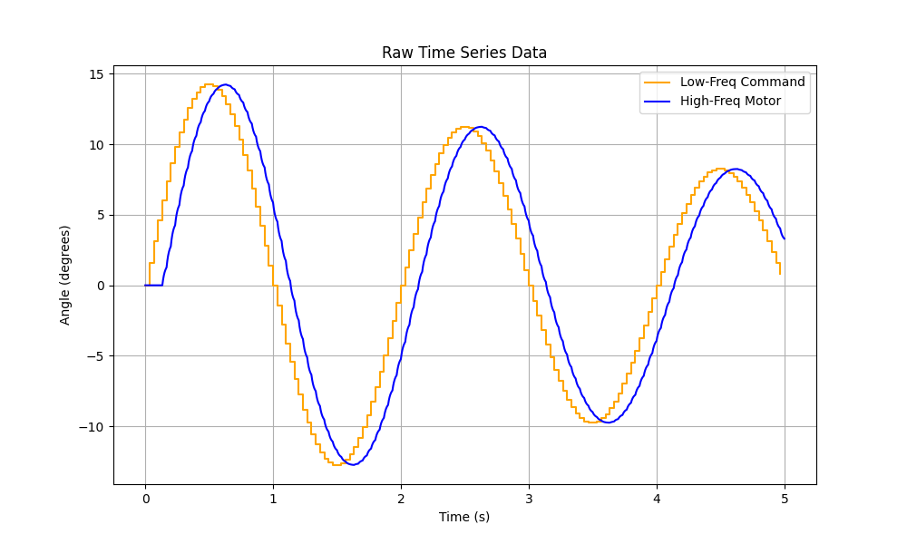

### Result of 4 aligment methods:

Left to right:  `cc custom code`, `cc fft lib`, `dtw custom`,  `dtw lib`

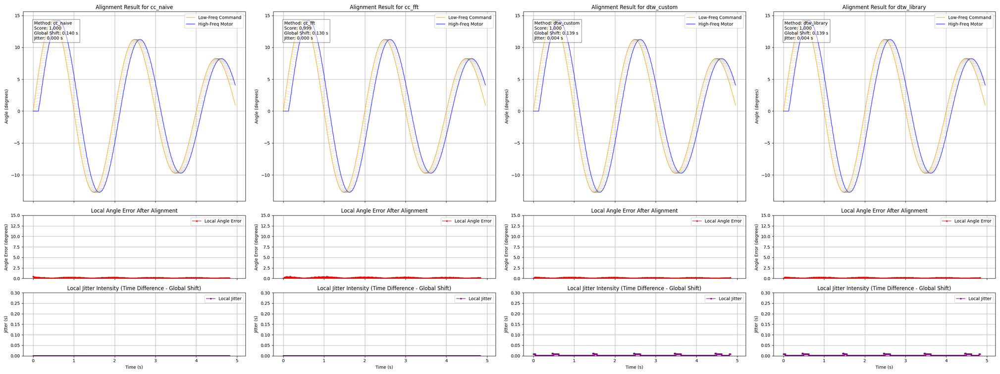

| Method        | Matching Score | Global Shift (s) | Jitter (s) | Runtime (s) |
|---------------|----------------|------------------|------------|-------------|
| cc_naive      | 0.9999         | 0.1400           | N/A        | 0.014       |
| cc_fft        | 0.9986         | 0.1300           | N/A        | 0.006       |
| dtw_custom    | 0.9999         | 0.1389           | 0.004      | 0.165       |
| dtw_library   | 0.9999         | 0.1389           | 0.004      | 0.017       |

* **Matching** : all methods give very **high matching score**.
it is not 100% perfect score due to motor PD process leads to:
  1) actual motor position's min and max can not fully reach command position's min and max,  
  2) extra, non-constant time delay.
* **Shift** : all methods gives **reasonable estimation**
result is larger than 1.0 sec, due to PD process introduced extra delay
* **Jitter** : DTW methods give **low jitter**, which is correct.
  * CC methods are not able to estimate **local time delay** or **jitter** at all.
* **Spatial Error** : all methods give **very low spatial error** which is correct.
* **Runtime** : FFT is fastest.  Efficient implementation of DTW is not too far off.


## Demo 1 Signal Delay
On top of average latency 100ms, add **150ms extra delay from 1sec to 2sec period**.

config_data_gen_1_delay.yaml
```yaml
extra_delay_start_time: 1.0  # Start time for extra delay (seconds)
extra_delay_end_time: 2.0    # End time for extra delay (seconds)
extra_delay_amount: 0.15     # Additional delay during the extra delay period (seconds)
```
### Generated time series data:
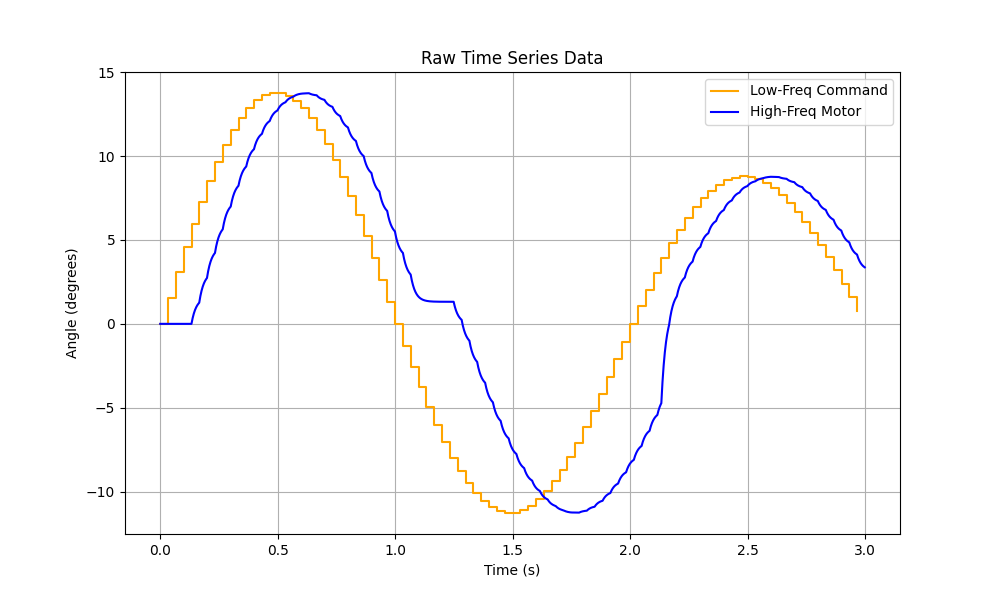

### DTW vs CC
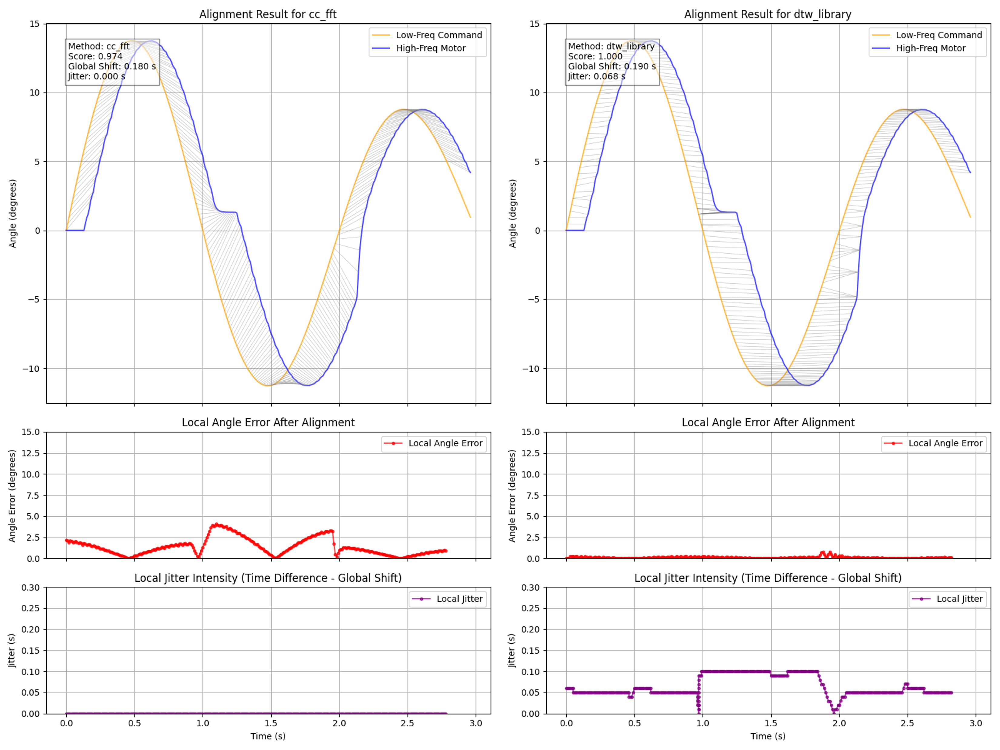

#### In this case, DTW is better than CC

1. CC's correspondance is wrong (left), DTW finds correct local correspondance (right).

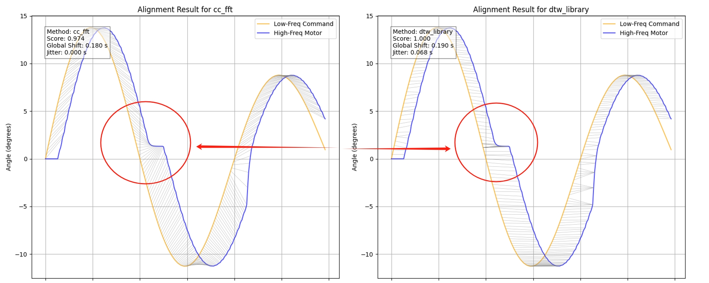

2. DTW can **correctly attribute the difference of 2 time series to 'time distance' or 'jitter'**,  and have **very low 'spatial error'**

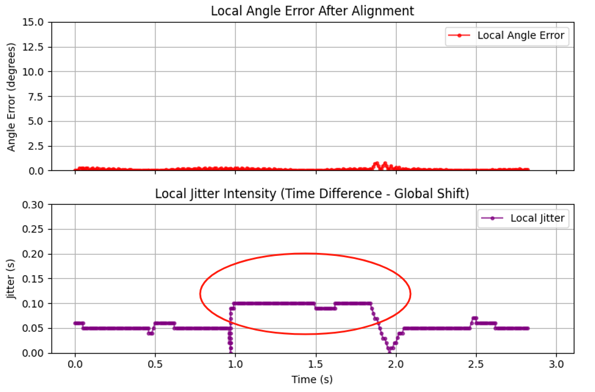

3. CC **incorrectly attribute the difference to spatial error**.

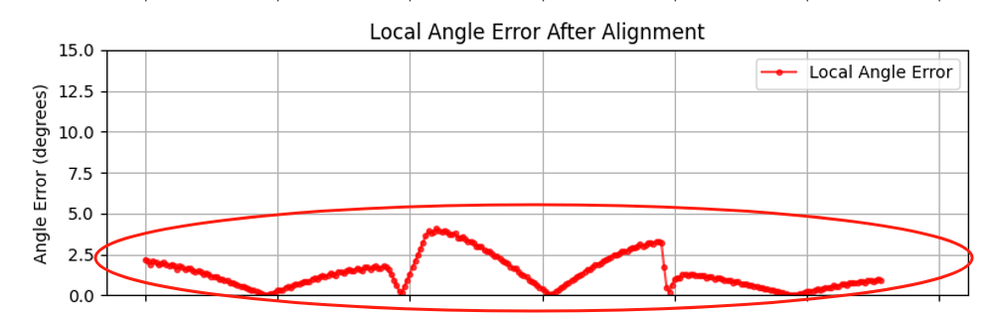

4. CC's score is 0.974, may **faile to match**.
DTW's score is 1.0, will **match successfully**.

## Demo 2 Random jitter
On top of average latency 100ms, add **random jitter of 50ms from 1sec to 2sec period**

config_data_gen_2_jitter.yaml
```yaml
jitter_std: 0.05  # Jitter standard deviation in seconds
jitter_start_time: 1.0  # Start time for applying jitter (seconds)
jitter_end_time: 2.0    # End time for applying jitter (seconds)
```

### Generated time series data:

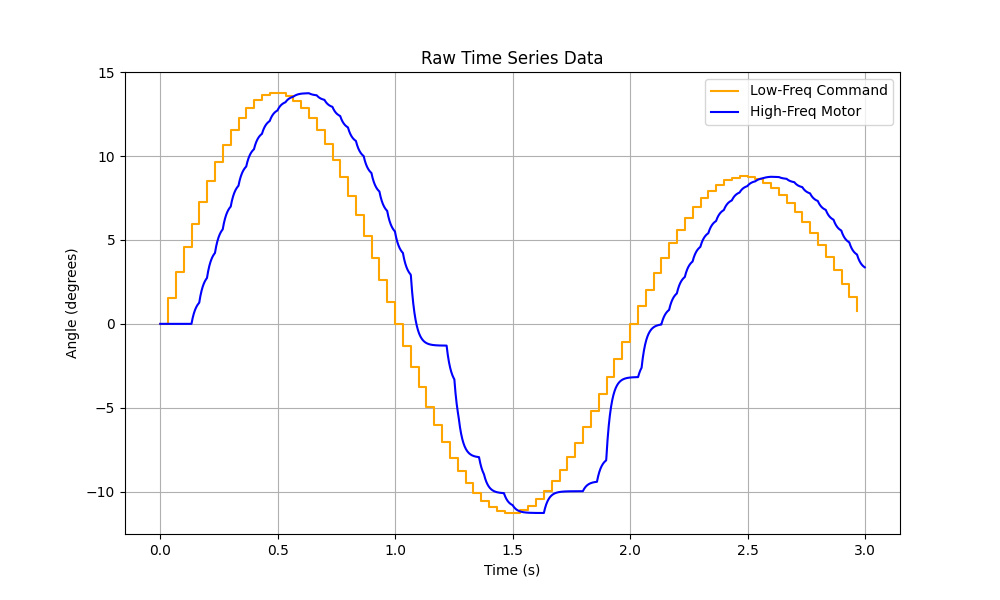

### DTW vs CC
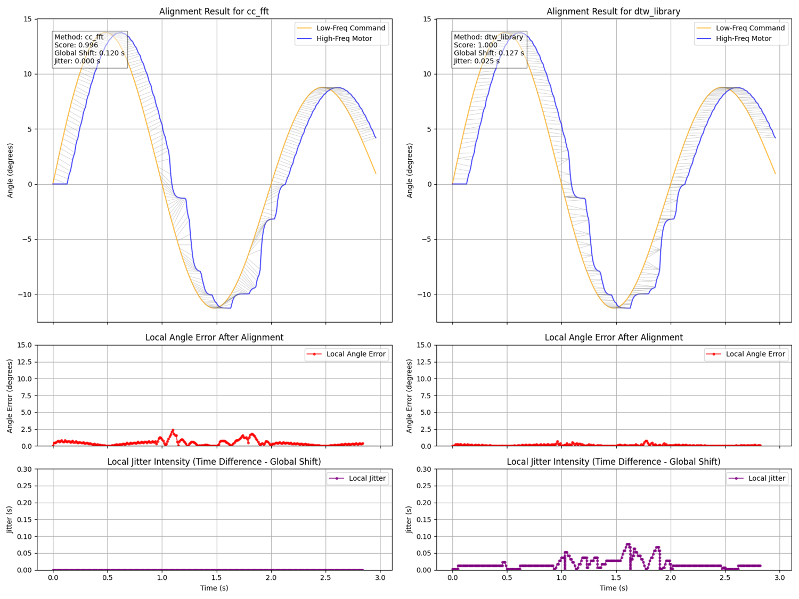

#### In this case, DTW is better than CC
* CC's correspondance is wrong (left), DTW finds correct local correspondance (right).
* DTW can correctly **attribute the difference to 'jitter'**,  and have **low 'spatial error'**
* CC incorrectly **attribute the difference to spatial error**.


## Demo 3 Adversal Case
Two time series looks similar but actually not from the same motion action.

config_data_gen_3_adversal.yaml
```yaml
crazy_errors: #crazy data changes
  flip: true    # flip time order
  negate: false  # *-1
```

### data:
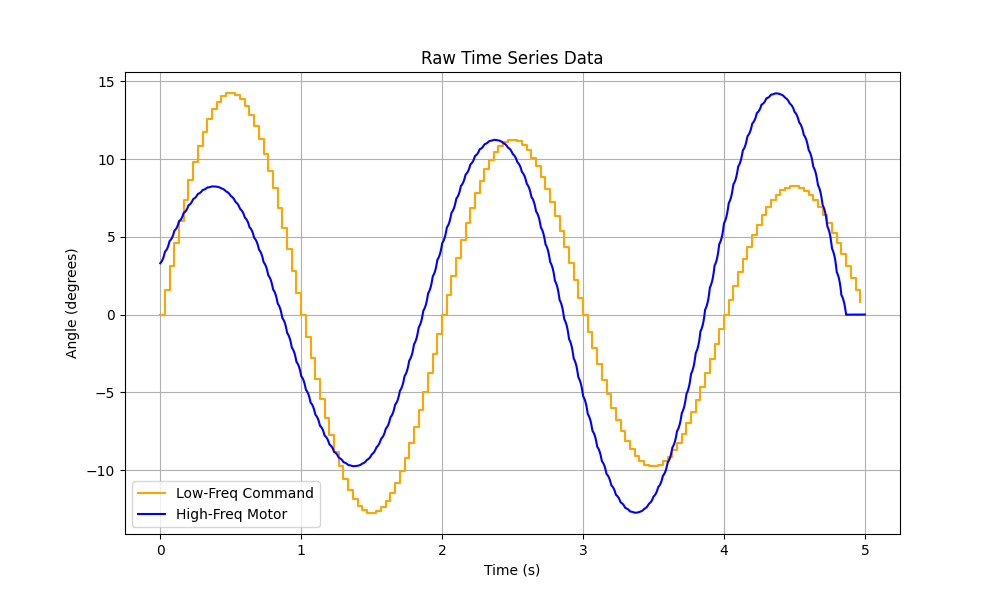

### DTW vs CC
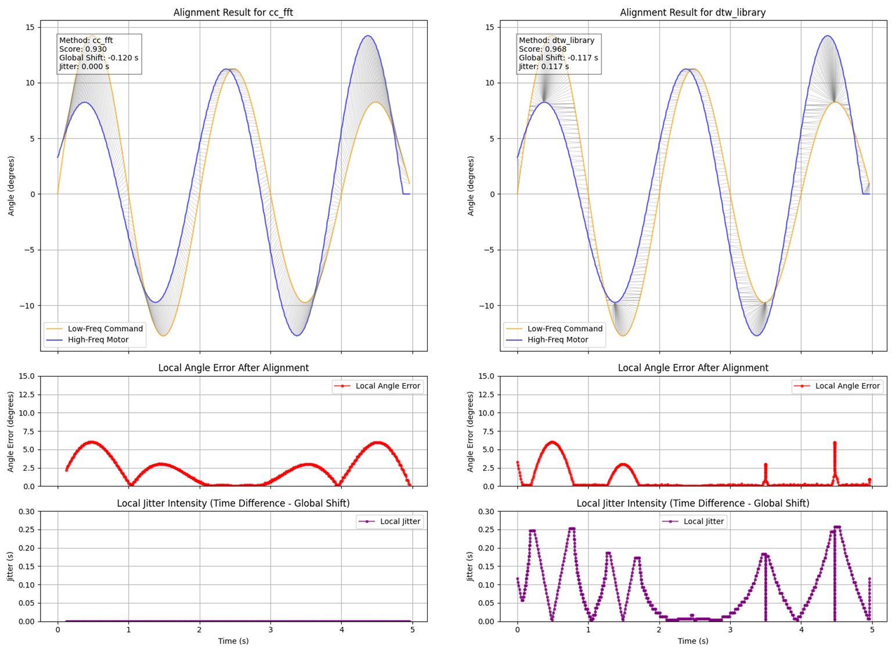

#### Both DTW and CC works

* by setting 'matching score' **threshold to 0.99** all methods can **correctly reject** this mismatch case.
* DTW detected both **high time domain error** and **high spatial domain error**.  Is **more robust** in identifying wrong match.


## Demo 4 Moving heavy objects

Simulate from 1.0sec to 2.0 sec the robot is holding a heavy object, reduced it's ability to follow command.

config_data_gen_4_heavy.yaml
```yaml
physical_errors:    # Inject physical disturbances
  heavy_object:
    start_time: 1.0
    end_time: 2.0
    alpha_factor: 0.1  # Reduced response factor
```

### data:
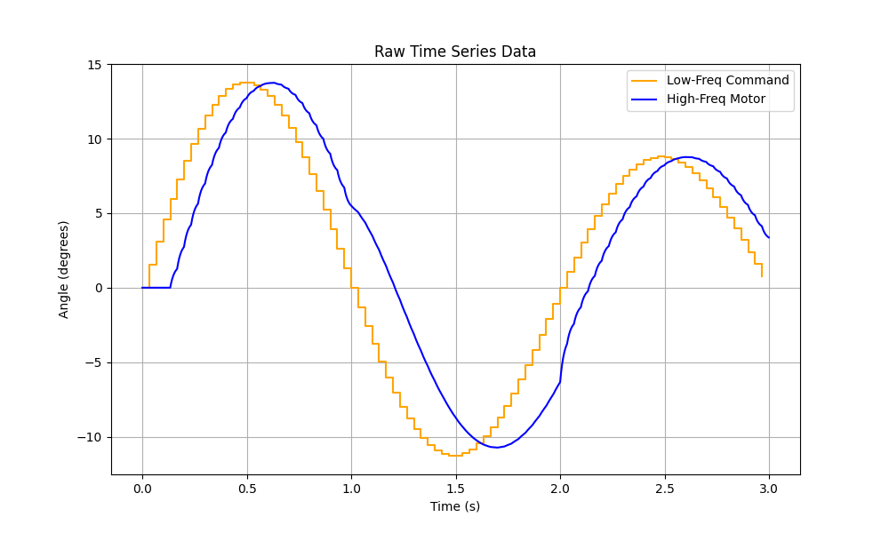

### DTW vs CC
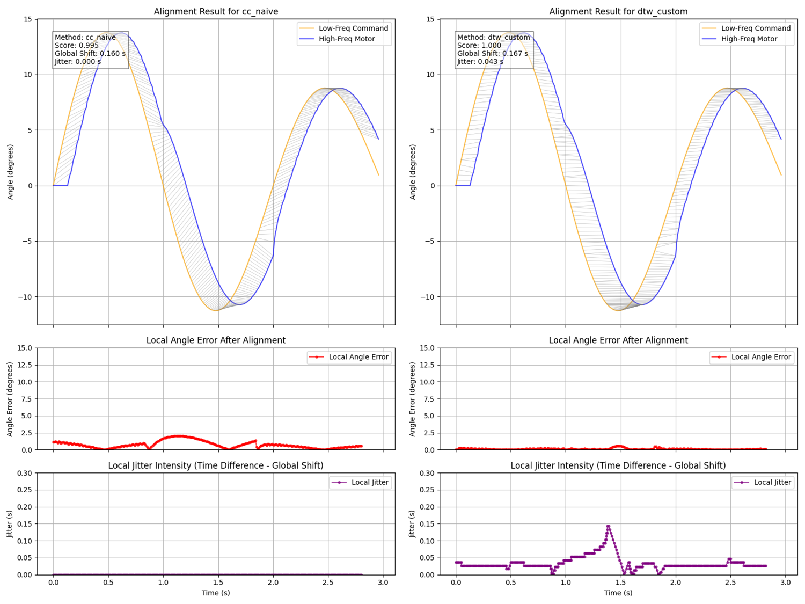

#### Both DTW and CC works
* Both have very high 'matching score', can **identify match successfully**.
* DTW attributed the difference to both **time domain error** and **spatial domain error**.  Is **more resonable** explanation of the physical process.


## Demo 5 Hit Wall

Simulate from 0sec to 1.0 sec the robot will hit a movement limit of 10 degrees (e.g. hit a wall).

config_data_gen_5_hit.yaml
```yaml
physical_errors:    # Inject physical disturbances
  hit_wall:
    start_time: 0.0  # Start of wall collision
    end_time: 1.0  # End of collision
    max_angle: 10.0  # Maximum angle during collision
```

### data:
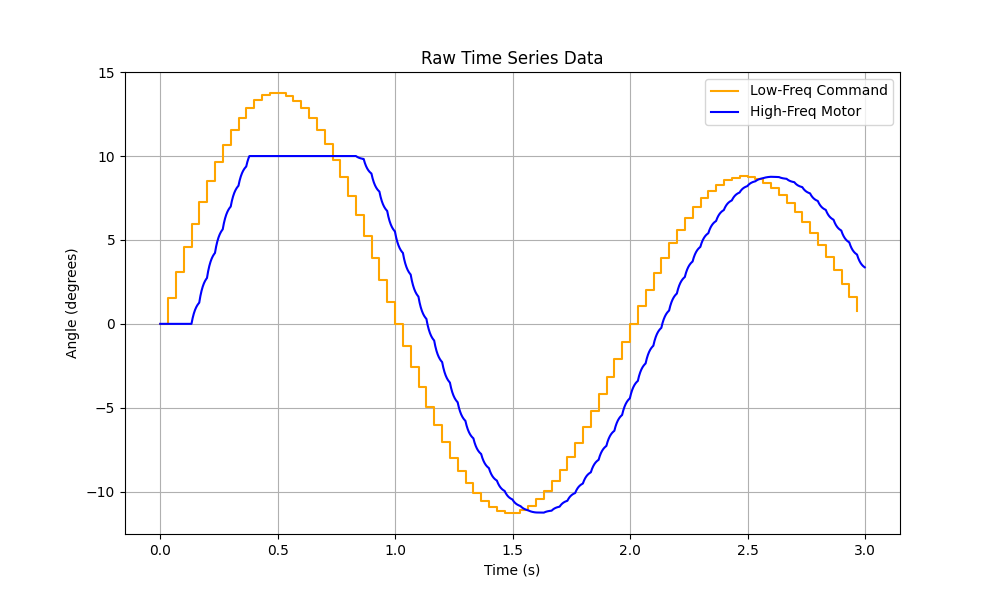

### DTW vs CC
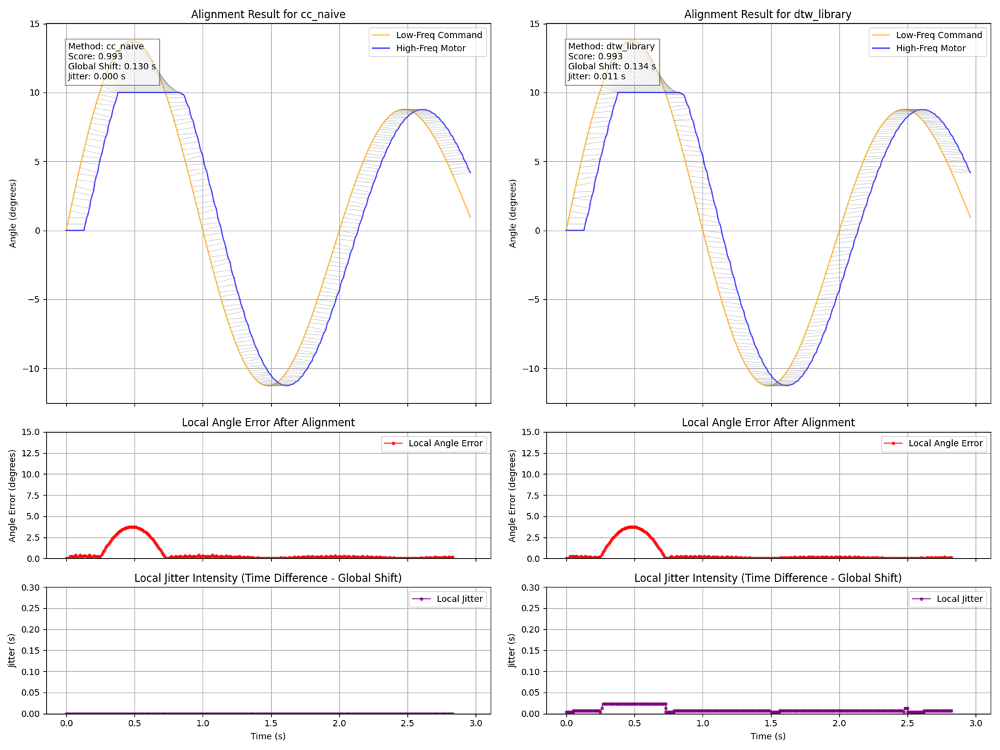

#### Both DTW and CC works
* Both have high 'matching score', can **identify match successfully**.
* DTW attributed the difference to both **time domain error** and **spatial domain error**.  Is **more resonable** explanation of the physical process.


## Demo 6 Motor Overheat

Simulate from 0sec to 5sec the motor is overheat, causing **reduced torque** and spikes.

**(the simulation is not realistic, it added spikes to position directly... instead of to toreque)**

config_data_gen_6_heat.yaml
```yaml
physical_errors:    # Inject physical disturbances
  overheat:
    start_time: 1.0
    end_time: 5.0
    torque_reduction: 0.1
    probability: 0.1  # Chance of noise spike
    noise_std: 0.2  # Noise magnitude
```

### data:
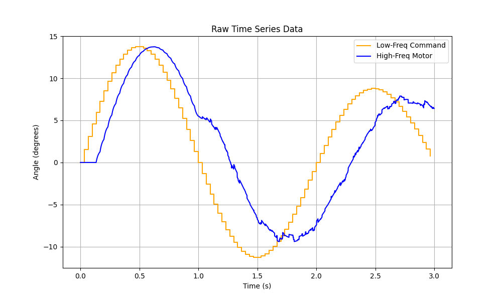

### DTW vs CC
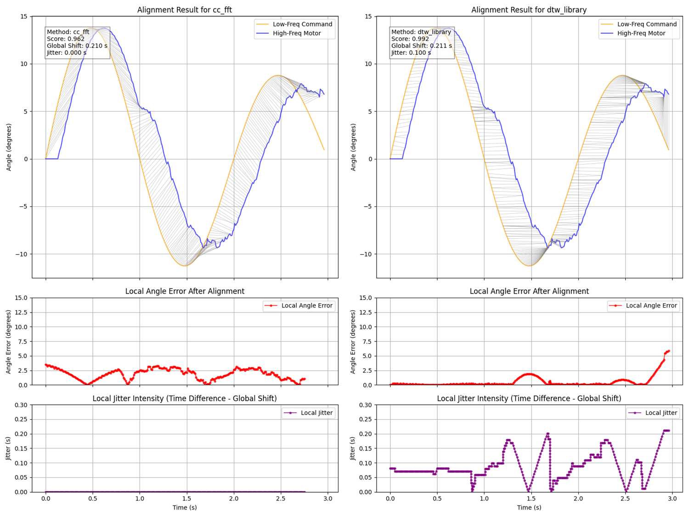

#### Only DTW works
* DTW still have high 'matching score' of 0.992, can **identify match successfully**.
* CC's match score is only 0.962, will **faile to match**.


## Demo 7 Source Error

Simulate the **low frequency command** have lots of issues:

* Unstable frequency (e.g. if source is camera based mocap or ai model)
* Skipped frames
* Noise in motion position

config_data_gen_7_source.yaml
```yaml
low_freq_irregularity: 0.02  # Timestamp variation in seconds
low_freq_skip_prob: 0.02  # Probability of skipping a frame
low_freq_noise_std: 0.2  # Noise standard deviation for angles
```

### data:
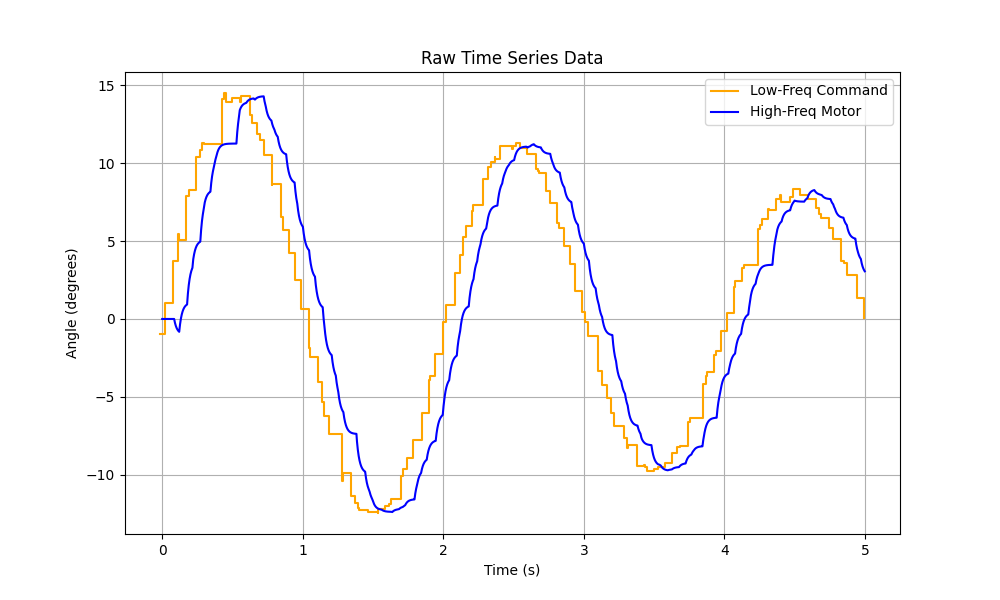

Due to noisy command, motor no longer able to move smoothly.

### DTW vs CC
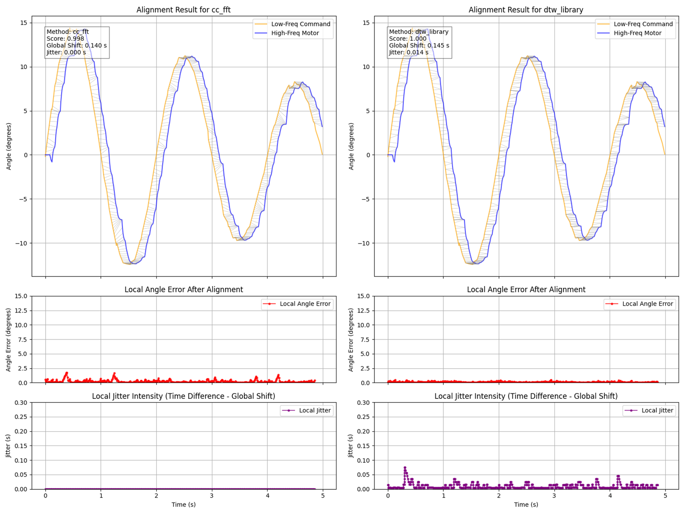

#### Both DTW and CC works
* Have high 'matching score' can **identify match successfully**.


## Demo 8 All Error

`config_data_gen_8_all.yaml`
Simulate all kinds of issues:

* Source command isues (non constant fps, position noise, dropped frames)
* Network issues (jitter, lost packet, )
* Physical disturbances (hit wall, heavy object, overheat)

### data:
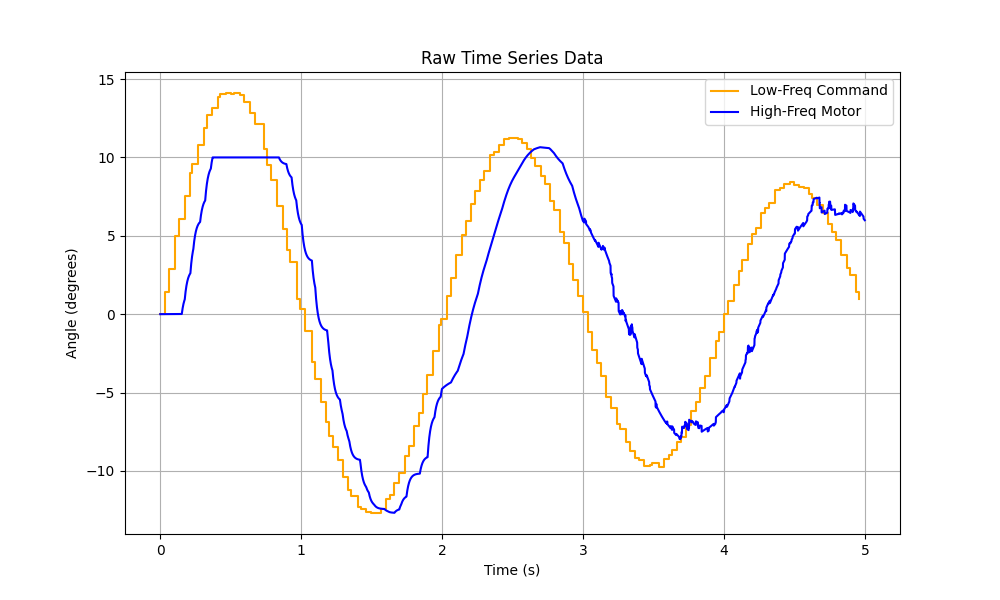

### DTW vs CC
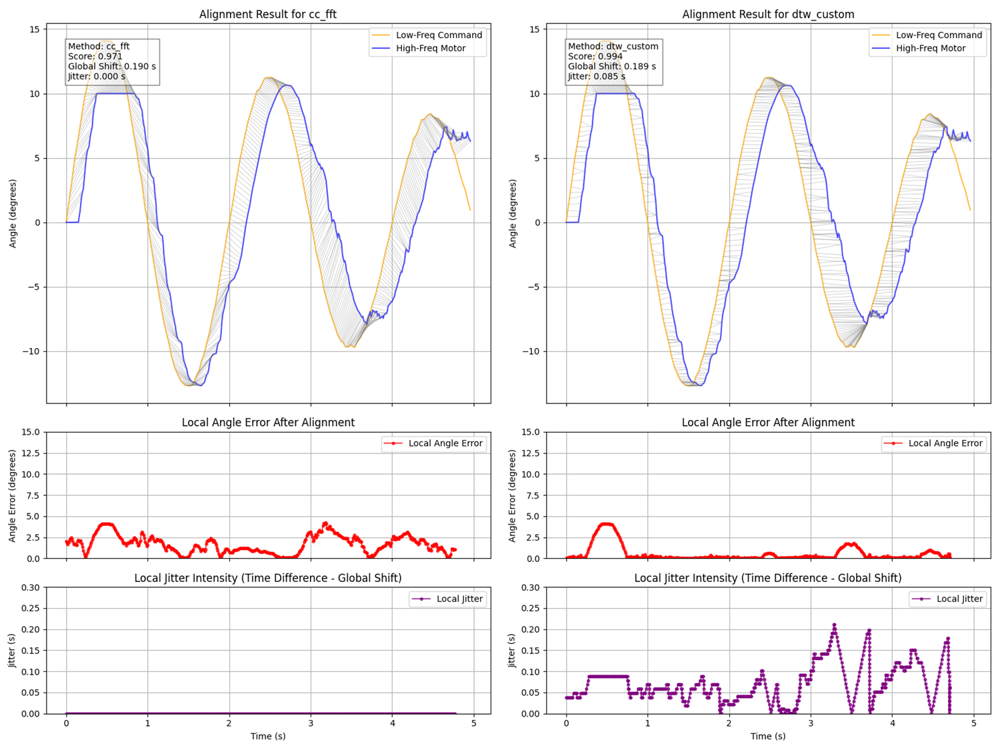

#### Only DTW works
* DTW still have high 'matching score' of 0.994, can **identify match successfully**.
* CC's match score is only 0.971, will **faile to match**.


# Overall


| Method      | 0 Simple     | 1 Delay     | 2 Jitter   | 3 Adversal  | 4 Heavy     | 5 Hit       | 6 Overheat    | 7 Source   | 8 All      |
|-------------|--------------|-------------|------------|-------------|-------------|-------------|---------------|------------|------------|
| CC          | Y            | N           | Y-         | Y           | Y           | Y           | N             | Y          | N          |
| DTW         | Y            | **Y**       | **Y+**     | Y           | Y           | Y           | **Y**         | Y          | **Y**      |

